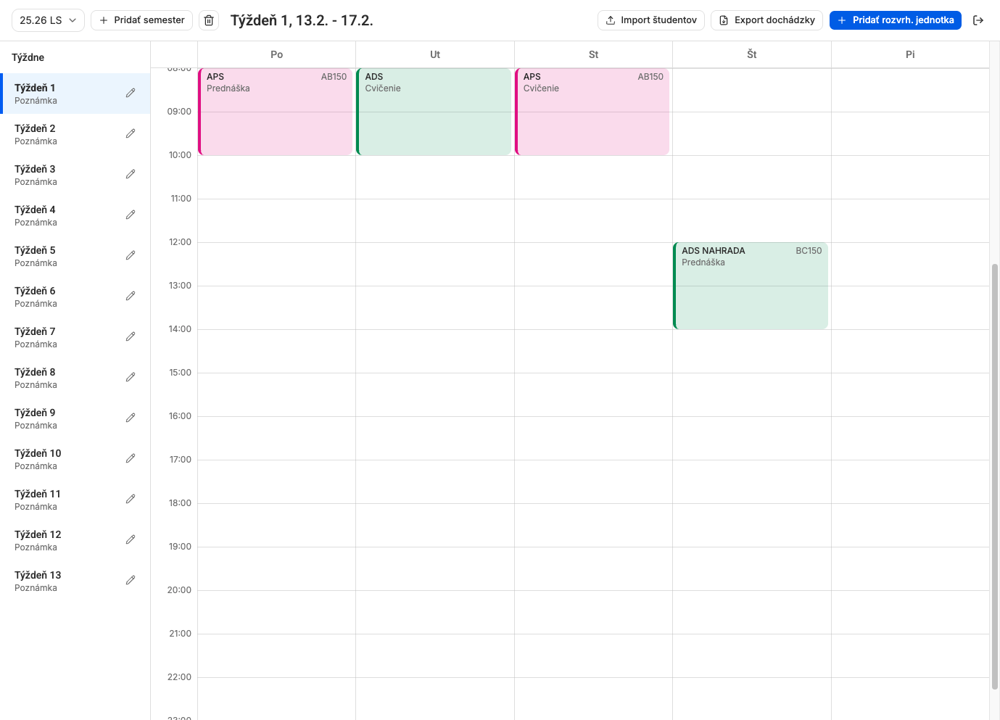
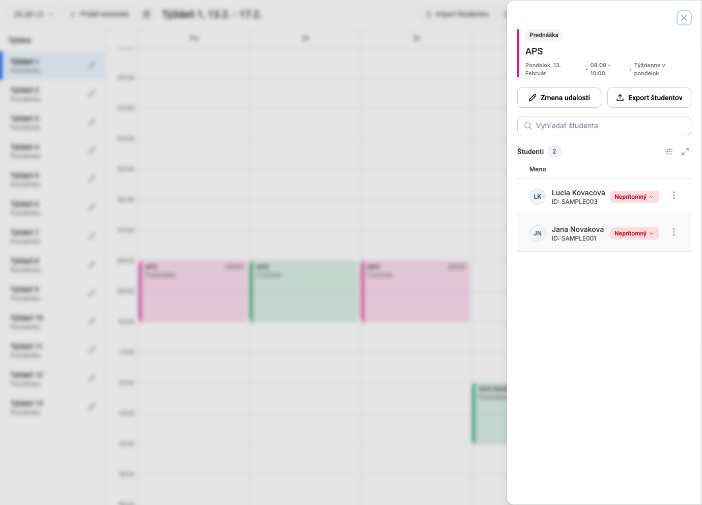
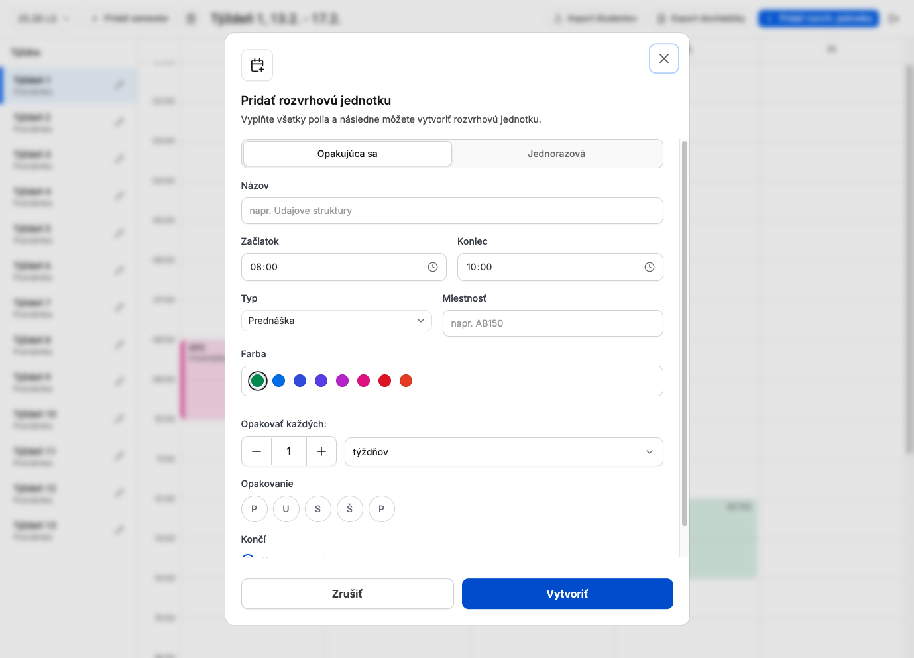
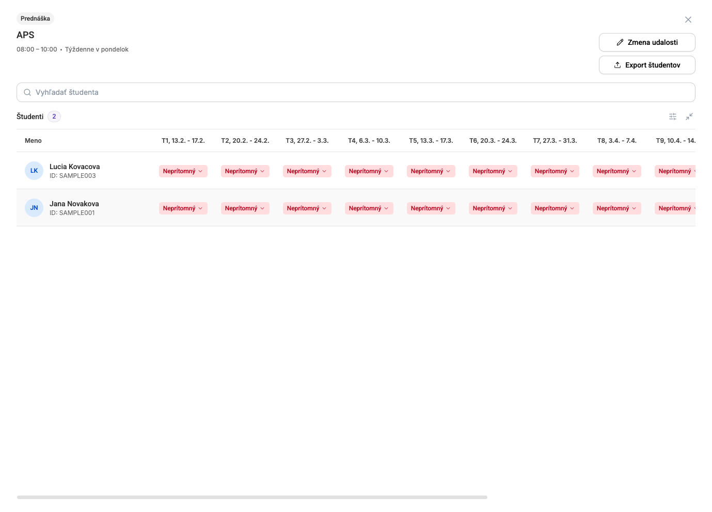

# ISIC Attendance Frontend

React 19 + TypeScript + Vite client for the ISIC attendance system. The app
connects to the FastAPI backend, displays semester schedules, manages students
inside schedule units, and exports attendance data.

## Requirements

- Node.js and npm
- Running backend API on `http://localhost:8000`
- Backend database seeded with an admin user and semester data

The development environment uses `.env.development`, which points
`VITE_API_URL` to the local backend.

## Run Locally

Start the full Docker stack from the multirepo root:

```bash
cd ..
docker compose up --build
```

This serves the production frontend through nginx at
`http://localhost:5173/` and proxies `/api/*` requests to the backend.

For frontend development with Vite, start the backend first and then run:

```bash
npm install
npm run dev
```

Open the app at `http://localhost:5173/`.

For local verification:

```bash
npm run lint
npm run build
```

## Useful Commands

```bash
npm run dev
npm run build
npm run lint
npm run preview
npm run generate-api-types
```

Student import examples are available in `public/samples/students-import.csv`.

## Screenshots



Main view: weekly calendar with semester controls, import/export actions, and
schedule units aligned to the time grid.



Event drawer: selected schedule unit details with editable attendance status
controls for enrolled students.



Create event modal: form for creating recurring or one-time schedule units,
including subject, time, type, room, color, and recurrence controls.



Students expanded view: subject-level attendance matrix with students in rows
and semester weeks in columns.
